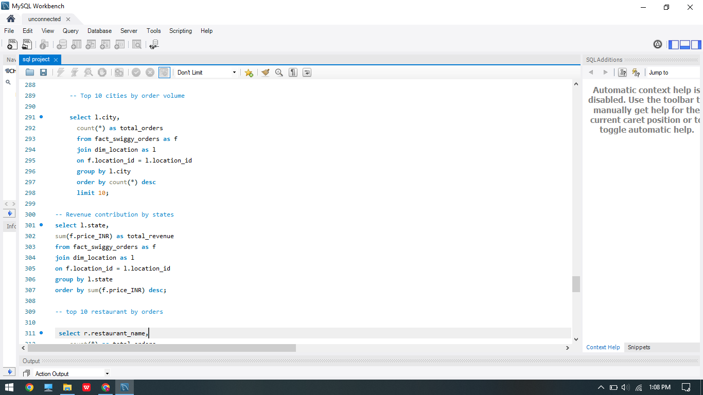
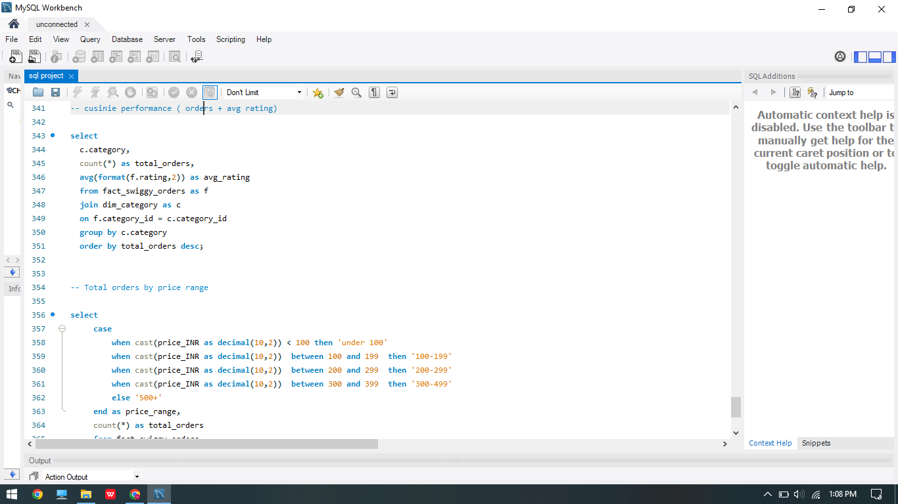
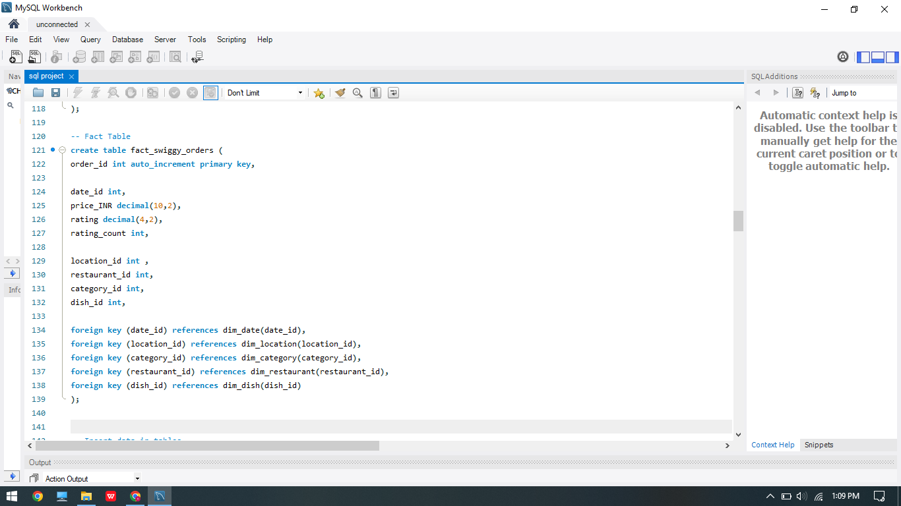
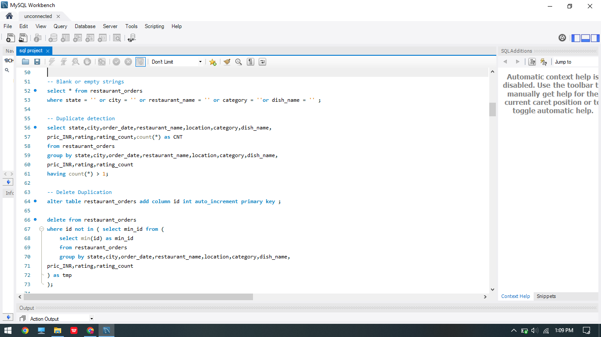
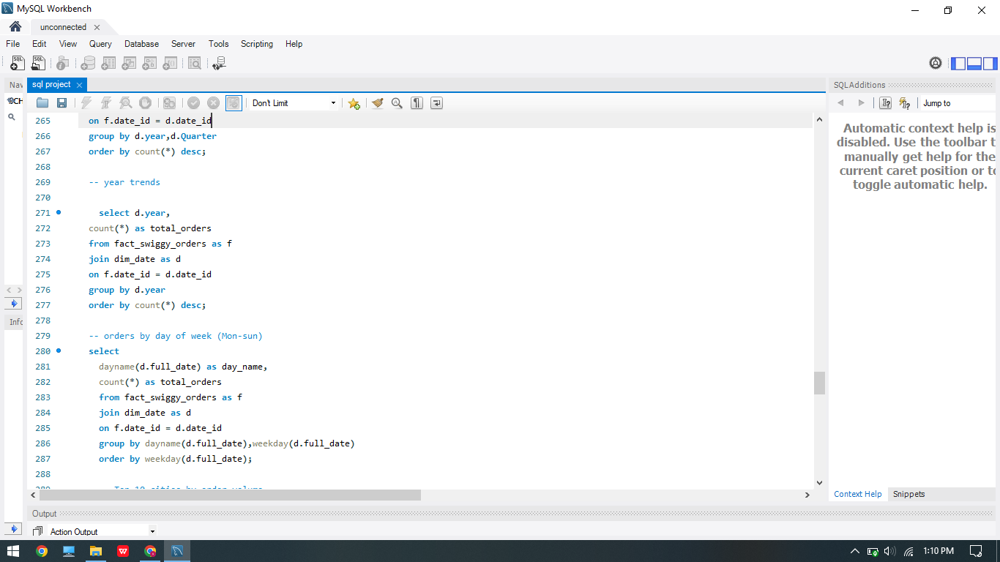

# 🍽️ Swiggy Data Warehouse & Business Analysis Using SQL

## 📌 Project Overview

This project focuses on building a complete **SQL-based Data Warehouse Solution** for Swiggy restaurant order data. The project includes data cleaning, validation, dimensional modeling, fact & dimension table creation, KPI analysis, and business insights generation using advanced SQL queries.

The main objective of this project is to transform raw food delivery data into a structured analytical database that can support reporting, dashboarding, and business decision-making.

---

# 🛠️ Tools & Technologies Used

* **MySQL**
* SQL Joins
* Window Functions
* Aggregate Functions
* Data Cleaning Techniques
* Star Schema Modeling
* Fact & Dimension Tables
* Business KPI Analysis

---

# 📂 Dataset Information

The dataset contains restaurant order-related information including:

* State
* City
* Order Date
* Restaurant Name
* Food Category
* Dish Name
* Price (INR)
* Rating
* Rating Count
* Location

---

# ⚙️ Project Workflow

## 1️⃣ Database & Raw Table Creation

* Created the raw table `restaurant_orders`
* Defined data types and constraints
* Imported CSV data using `LOAD DATA INFILE`

## 2️⃣ Data Cleaning & Validation

Performed multiple data quality checks:

* Null value detection
* Blank value detection
* Duplicate record identification
* Duplicate removal using `AUTO_INCREMENT ID`
* Date format correction using `STR_TO_DATE()`

## 3️⃣ Data Warehouse Design

Implemented a **Star Schema Model**.

### Dimension Tables

* `dim_date`
* `dim_location`
* `dim_restaurant`
* `dim_category`
* `dim_dish`

### Fact Table

* `fact_swiggy_orders`

## 4️⃣ Data Transformation

* Populated dimension tables using distinct values
* Built relationships using foreign keys
* Loaded transformed data into the fact table

## 5️⃣ Business Analysis

Created SQL queries to analyze:

* Order trends
* Revenue trends
* Customer rating patterns
* Restaurant performance
* Cuisine performance
* City & state performance
* Pricing analysis
* Top-selling dishes

---

# 📊 Key KPIs

The following KPIs were calculated:

* Total Orders
* Total Revenue
* Average Dish Price
* Average Rating
* Monthly Order Trends
* Quarterly Order Trends
* Yearly Growth Trends
* Top Cities by Orders
* Top Restaurants by Orders
* Cuisine Performance
* Price Range Distribution

---

# 📈 Business Insights

## 🔹 Overall Dataset KPIs

* **Total Orders Analyzed:** 197,430
* **Total Revenue Generated:** ₹5.30 Crores+
* **Average Order Value:** ₹268.51
* **Average Customer Rating:** 4.34 ⭐

---

## 🏙️ Top Cities by Revenue

| City      | Revenue      |
| --------- | ------------ |
| Bengaluru | ₹54.56 Lakhs |
| Lucknow   | ₹31.17 Lakhs |
| Hyderabad | ₹30.21 Lakhs |
| Mumbai    | ₹30.15 Lakhs |
| New Delhi | ₹28.29 Lakhs |

### 📌 Insight

* Bengaluru generated the highest revenue among all cities.
* Metro cities dominated food delivery demand and spending.

---

## 🍔 Top Restaurants by Revenue

| Restaurant     | Revenue      |
| -------------- | ------------ |
| KFC            | ₹42.46 Lakhs |
| McDonald's     | ₹33.43 Lakhs |
| Pizza Hut      | ₹21.33 Lakhs |
| Burger King    | ₹19.00 Lakhs |
| Domino's Pizza | ₹18.34 Lakhs |

### 📌 Insight

* Fast-food chains contributed the largest share of platform revenue.
* KFC alone generated more than ₹42 Lakhs in sales.

---

## 🍽️ Most Ordered Dishes

| Dish                 | Orders |
| -------------------- | ------ |
| Choco Lava Cake      | 303    |
| Veg Fried Rice       | 243    |
| Chicken Sausage      | 227    |
| Paneer Butter Masala | 226    |
| Jeera Rice           | 219    |

### 📌 Insight

* Dessert and combo-friendly dishes had the highest order frequency.
* Indian and Chinese dishes showed consistently high demand.

---

## 📦 Pricing Insights

* **Average Dish Price:** ₹268.51
* **Premium Orders Above ₹500:** 7.85% of total orders

### 📌 Insight

* Most users preferred affordable meals.
* Premium food ordering exists but represents a smaller customer segment.

---

## ⭐ Customer Rating Insights

* **Average Rating:** 4.34 ⭐
* **Orders with Rating ≥ 4.5:** 27.25% of total orders

### 📌 Insight

* Customer satisfaction is generally very strong across restaurants.
* Highly rated restaurants are likely driving repeat purchases.

---

## 🌍 State-Level Insights

Top revenue-generating states:

1. Karnataka
2. Uttar Pradesh
3. Telangana
4. Maharashtra
5. Delhi

### 📌 Insight

* South Indian and metro-state markets contribute heavily to Swiggy’s business.

---

# 🧠 Advanced SQL Concepts Used

* Aggregate Functions
* CASE Statements
* GROUP BY & HAVING
* INNER JOINs
* Data Cleaning Queries
* Primary & Foreign Keys
* Star Schema Modeling
* Date Functions
* Subqueries
* Duplicate Handling Logic

---

# 📸 Project Screenshots

## Screenshot 1

## Screenshot 2

## Screenshot 3

## Screenshot 4

## Screenshot 5

# 🚀 Future Improvements

* Create Power BI Dashboard using the warehouse tables
* Add stored procedures for automation
* Implement indexing for query optimization
* Build ETL pipeline using Python
* Schedule automated data refresh
* Add customer segmentation analysis

---

# 📚 Learning Outcomes

Through this project, I gained hands-on experience in:

* SQL Data Cleaning
* Database Design
* Data Warehousing
* Star Schema Modeling
* Business KPI Analysis
* Query Optimization
* Analytical SQL Development

---

# ✅ Conclusion

This project demonstrates an end-to-end SQL data analytics workflow starting from raw data cleaning to advanced business analysis using a properly structured data warehouse. It showcases practical SQL skills required in real-world data analyst and business intelligence roles.

The project helped in understanding how analytical databases are designed and how SQL can be used effectively to generate meaningful business insights from raw operational data.

---

# 👨‍💻 Author

**Sagar Singh**

If you found this project useful, feel free to give it a ⭐ on GitHub.
